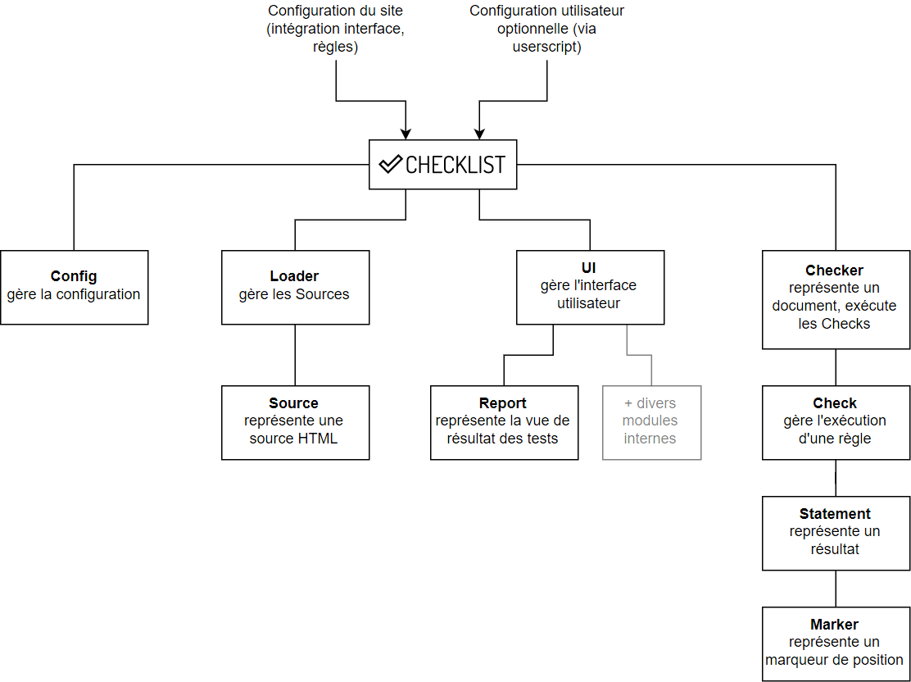

# OpenEdition Checklist

## Installation

1. Cloner le dépôt.
2. Installer les dépendances `npm install`.
3. Compiler le script : `npm run build`

Checklist requiert jQuery et Font Awesome 5.

```html
  <!-- Font awesome -->
  <link rel="stylesheet" href="https://use.fontawesome.com/releases/v5.5.0/css/all.css" integrity="sha384-B4dIYHKNBt8Bc12p+WXckhzcICo0wtJAoU8YZTY5qE0Id1GSseTk6S+L3BlXeVIU" crossorigin="anonymous">

  <!-- jQuery  -->
  <script src="../node_modules/jquery/dist/jquery.min.js"></script>

  <!-- Noyau de checklist -->
  <script src="../dist/checklist.js"></script>

  <!-- Configuration de checklist (voir plus bas) -->  
  <script src="path/to/checklist-config.js"></script>
```

## Utilisation

### Initialisation et lancement

```javascript
// Intialisation de checklist
checklist.init({
  // Définir le parent où l'UI sera intégré.
  // Si cette variable est vide, l'UI ne sera pas créée.
  parent: "body",

  // Prefixe des clés du localStorage
  // Sur Revues.org et OpenEdition Books, utiliser le nom court
  namespace: "foobar",

  // Langue de l'interface
  lang: "fr",

  // Nombre maximum de requêtes Ajax lancées simultanément par le Loader
  maxSourcesLoading: 5,

  // Timeout des requêtes Ajax lancées par le Loader
  loaderTimeout: 10000,

  // Surcharger les traductions par défaut de l'interface. Voir src/ui/locales/
  translations: {
    fr: {
      "toc-check": "Contrôler le numéro"
    }
  },

  // Une fonction qui permet de créer les boutons de la barre d'outil.
  // Prend l'identifant du document en paramètre.
  buttonsCreator: function (docId, context) {
    return [
      {
        title: {
          fr: "Editer le document",
          en: "Edit document"
        },
        icon: "<i class='fas fa-edit'></i>",
        attributes : {
          href: `${docId}/edit`
        }
      },
      {
        title: {
          fr: "Télécharger la source",
          en: "Download source"
        },
        condition: "textes && article",
        icon: "<i class='far fa-file-word'></i>",
        attributes: {
          onclick: "doStuff()"
        }
      }
    ];
  },

  // Liste des types utilisés dans les règles et configuration de leur affichage dans l'interface
  types: [
    {
      id: "danger",
      name: {
        fr: "Avertissements",
        en: "Danger"
      },
      color: "#ed5740"
    },
    {
      id: "warning",
      name: {
        fr: "Recommandations",
        en: "Warning"
      },
      color: "#f8d14c"
    },
    {
      id: "info",
      name: {
        fr: "Informations",
        en: "Information"
      },
      color: "#3d9cdf"
    }
  ],

  // Liste des filtres utilisés dans l'interface
  filters: [
    {
      id: "tag-paper",
      name: {
        fr: "Publication papier",
        en: "Print"
      }
    }
  ],

  // Liste des notes attribuées aux documents et configuration de leur affichage dans l'interface
  ratings: [
    {
      id: "bad",
      icon: "<i class='far fa-meh'></i>",
      text: {
        fr: "Ce document contient des erreurs de composition.",
        en: "This document contains issues."
      },
      color: "#a94442",
      bgcolor: "#f2dede"
    },
    {
      id: "good",
      icon: "<i class='far fa-smile'></i>",
      text: {
        fr: "Ce document est correctement composé.",
        en: "This document is well formated."
      },
      color: "#31708f",
      bgcolor: "#d9edf7"
    },
    {
      id: "excellent",
      icon: "<i class='far fa-laugh-wink '></i>",
      text: {
        fr: "Ce document est très bien composé.",
        en: "This document is well formated."
      },
      color: "#3c763d",
      bgcolor: "#dff0d8"
    },
    {
      id: "empty",
      icon: "<i class='far fa-question-circle'></i>",
      text: {
        fr: "Aucun test n'est prévu pour ce document.",
        en: "This document can not be checked."
      },
      color: "#999",
      bgcolor: "#eee"
    }
  ],

  // Fonction de calcul du rating affiché dans le report.
  // Prends les statements du report, et le report lui-même en paramètre et retourne un id de rating.
  computeRating: function (statements, report) {
    if (report.checksCount === 0) return "empty";
    let warning = false;
    for (let i=0; i < statements.length; i++) {
      const statement = statements[i];
      const type = statement.type;
      if (type === "danger") return "bad";
      if (type === "warning") warning = true;
    }
    return warning ? "good" : "excellent";
  },

  // Fonction de création du contexte.
  context: function ($) {
    return {
      "article": true,
      "textes": true,
      "publication": false,
      "motsclesfr": $(".motsclesfr .entry").length
    };
  },

  // Liste des règles.
  rules: [
    {
      id: "missing-title"
      name: {
        fr: "Absence de titre",
        en: "Missing title"
      },
      description: {
        fr: "<p>Le titre n'est pas présent sur la page.</p>",
        en: "<p>Title was not found on this page.</p>"
      },
      condition: "article || publication",
      type: "danger",
      action: function ($, bodyClasses) {
        var flag = $("h1").length === 0;
        this.resolve(flag);
      }
    },
    // etc.
  ],

  // Clé à utiliser dans le cas où la page courante contient une table des matières.
  // Dans ce cas, le raport de l'entité en cours ne sera pas automatiquement affiché dans le panel. À la place, l'option de relecture de la table des matières sera proposée à l'utilisateur.
  // Par exemple :
  publi: {
    title: "Titre de la publication",
    parent: "body", // si ce sélecteur n'est pas spécifié, la toc sera injectée dans config.parent
    toc: [
      {
        title: $(".publi-title").text(),
        href: window.location.href, // indique qu'il s'agit de la page courante
        type: "Publication",
        icon: "<i class='fas fa-book'></i>",
        context: {"publications": true}
      }
      {
        title: "Premier article",
        href: "url/to/article1.html",
        context: {
          "textes": true,
          "article": true
        }
      },
      {
        "title": "Une sous-partie",
        "section": [
          {
            "title": "Deuxième article",
            "href": "ulr/to/article2.html",
            "context": {
              "textes": true,
              "article": true
            }
          }
        ]
      }
      // etc.
    ]
  }
})
.then(function () {
  // La méthode checklist.run() exécute Checklist et retourne une promesse qui transmet le Checker.
  // Cette méthode prend un objet optionnel {href, rules} en paramètre :
  // * href: liste d'URL pour exécuter Checklist. En cas d'omission c'est la page courante qui est utilisée.
  // * rules: liste de règles à exécuter. En cas d'omission, les règles déclarées dans la configuration sont utilisées.
  checklist.run().then((checker) => {
    console.log("Exécution terminée !");
  })
  .catch(console.error);
});
```

### Définition des règles

```javascript
{
  // Nom de la règle.
  name: {
    fr: "Nom de la règle",
    en: "Rule name"
  },

  // Identifiant des statements créés par défaut par la règle.
  // S'il n'est pas précisé, il sera créé d'après l'attribut name. Il est toutefois fortement recommandé de donner un id à chaque règle.
  id: "id-de-la-regle",

  // Aide associée. Accepte le HTML.
  description: {
    fr: "<p>C'est une règle de démonstration.</p>",
    en: "<p>This is a sample rule.</p>"
  },

  // URL du document où appliquer cette règle. Si vide, on utilise le document du checker.
  href: "./pages/1.html",

  // Condition d'exécution de la règle.
  // Peut être une string à comparer avec le contexte du checker, ou une fonction qui prend le contexte en paramètre et renvoit un booléen.
  condition: "article && !texte",

  // Type par défaut des statements crés par la règle.
  // Valeur : "info" (defaut)|"warning"|"danger"
  type: "warning",

  // Étiquettes associées à cette règle.
  // Permet de créer des filtres spécifiques dans l'interface.
  tags: ["paper"],

  // Action de la règle.
  // Ne pas oublier de passer $ en paramètre pour que la règle fonctionne avec les sources externes chargées par le loader.
  // Dans le cas de sources externes chargées via ajax, le tag body est remplacé par un div pour éviter une erreur du DOM. Pour cette raison le deuxième paramètre d'action() correspond aux classes du body de la source.
  action: function ($, bodyClasses) {
    // Créer un statement en utilisant les valeurs par défaut de la règle
    this.notify();

    // Il est posible d'incrémenter le compteur en ajoutant d'autres statements identiques (= qui ont le même id).
    for (var i=0; i < 3; i++) {
      this.notify();
    }

    // Si notify prend false pour argument alors il n'est pas pris en compte (c'est une écriture courte pour éviter les blocs conditionnels)
    const flag = 0 === 1;
    this.notify(flag);

    // Créer un statement avec des valeurs personnalisées.
    this.notify({
      name: {
        fr: "Une notification différente",
        en: "A different notification"
      },
      id: "un-id-different",
      description: {
        fr: "<p>Ce Statement n'a pas la même description que la règle parente.</p>",
        en: "<p>This Statement has a different description."
      },
      type: "danger",
      tags: []
    });

    // Ajouter des markers.
    var statement = this.notify();
    statement.addMarker({
      // Titre du marker.
      // Par défaut on utilise le nom du statement (qui est lui même peut-être hérité de la règle, voir ci-dessus).
      name: {
        fr: "Texte du marker",
        en: "Marker text"
      },

      // Type du marker.
      // Par défaut on utilise le type du statement (qui est lui même peut-être hérité de la règle, voir ci-dessus).
      type: "danger",

      // Element cible.
      target: $("h1").get(0),

      // Position: "after"|"before"
      position: "after"
    });

    // Déclarer un exception au cours du test (si par exemple un élément de maquette n'existe pas)
    this.reject("Message d'erreur");

    // Déclarer la fin du test avec resolve().
    // C'est indipensable car tous les tests sont asynchrones.
    // Si un argument est donné, this.notify() est exécuté avec cet argument avant la fin du test. Il est donc possible de créer une notification par défaut avec l'argument true.
    this.resolve(true);
  }
}
```

## Fonctionnement interne



La méthode `checklist.init(siteConfig)` permet de définir la configuration propre au site et d'initialiser checklist sur la page.

La méthode `checklist.run(options)` permet de lancer la relecture d'un document :

* Une instance de Checker est créée.
* Celle-ci demande au Loader la source correspondant à l'URL du document. Le Loader retourne une Source (qu'il a éventuellement créée et chargée si nécessaire).
* Le checker calcule le contexte à partir de la source.
* Pour chaque règle (`rule`), une instance de Check est crée par le Checker.
* Le check vérifie que `rule.condition` correspond bien au contexte du checker. Le cas échéant, la règle est exécutée.
* Chaque règle a la possibilité de créer une ou plusieurs instances de Notification et de Marker.
* Si une UI est attachée à Checklist, alors les notifications et les markers sont progressivement transmises à l'UI qui les affiche.

La plupart des méthodes de ces modules retournent des promesses. La communication entre les différents modules est assurée par des événements.

## Événements

L'objet `checklist` émet les événements suivants :

* `checker.run`: émis lors de l'exécution d'un checker. Le checker est passé en argument du event handler.
* `checker.done`: émis à la fin de l'exécution d'un checker. Le checker est passé en argument du event handler.
* `check.dropped`: émis lorsqu'un check n'est pas exécuté parce que sa condition ne correspond pas au contexte. Le check est passé en argument du event handler.
* `check.run`: émis lors de l'exécution d'un check. Le check est passé en argument du event handler.
* `check.done`: émis à la fin de l'exécution d'un check. Le check est passé en argument du event handler.
* `check.success`: émis à la fin de l'exécution d'un check, uniquement en cas de succès. Le check est passé en argument du event handler.
* `check.rejected`: émis quand un check lève un exception. L'erreur est passée en premier argument et le check est passé en deuxième argument du event handler.
* `statement.new`: émis quand un statement est créé. Le statement est passé en argument du event handler.

Tous les objets internes de checklist exposent les attributs `classname` qui correspond au nom de la classe de l'objet, et `caller` qui est une référence au parent ayant créé l'objet en cours.

Pour connaître le checker responsable de la création d'un statement, il est donc possible de faire :

```javascript
  checklist.on("statement.new", function (statement) {
    var check = statement.caller;
    var checker = check.caller;
  });
```

## Développement

Les scripts npm suivants sont disponibles :

* `build`: compiler le script.
* `watch`: compiler le script automatiquement quand le code est modifié.
* `test`: lancer les tests unitaires et la démo dans le navigateur.
* `dev`: compiler et relancer les tests automatiquement quand le code est modifié.
* `test-https` et `dev-https` : variantes de `test` et `dev` qui utilisent https pour servir le script. Utile pour tester le script sur un site en https où le navigateur bloquera les contenus servis en http.

## License

**OpenEdition Checklist**  
**Copyright (c) 2017 OpenEdition, Thomas Brouard**

This program is free software: you can redistribute it and/or modify it under the terms of the GNU General Public License as published by the Free Software Foundation, either version 3 of the License, or (at your option) any later version.

This program is distributed in the hope that it will be useful, but WITHOUT ANY WARRANTY; without even the implied warranty of MERCHANTABILITY or FITNESS FOR A PARTICULAR PURPOSE. See the GNU General Public License for more details.

You should have received a copy of the GNU General Public License along with this program. If not, see http://www.gnu.org/licenses/.
